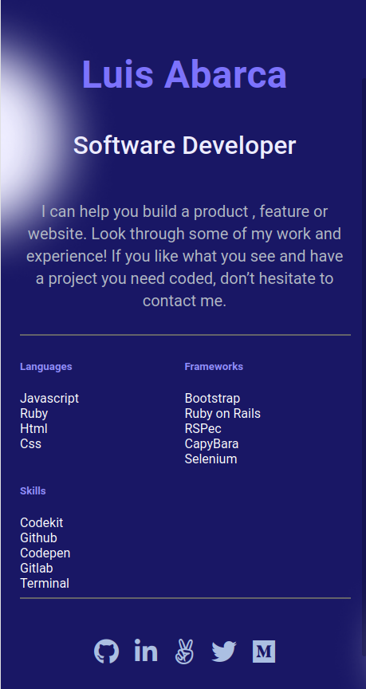

# My Personal Portfolio

My portfolio where I show to the world what can i offer them.

In this project I show my skills and my other projects and is a way to centralize all my projects.

## Built With

- HTML5
- CSS3

## Getting Started

To get a local copy up and running follow these simple example steps:

- Select the link with the code on the https code tab in the repo.
- Open a Terminal and write the command: git clone "TheLinkWithCode".
- Drag the index.html to any browser.

## Authors

👤 **Author1**

- GitHub: [@TheLuisAbarca](https://github.com/TheLuisAbarca)

## 🤝 Contributing

Contributions, issues, and feature requests are welcome!

Feel free to check the [issues page](../../issues/).

## Show your support

Give a ⭐️ if you like this project!

## 📝 License

This project is [MIT](./MIT.md) licensed.